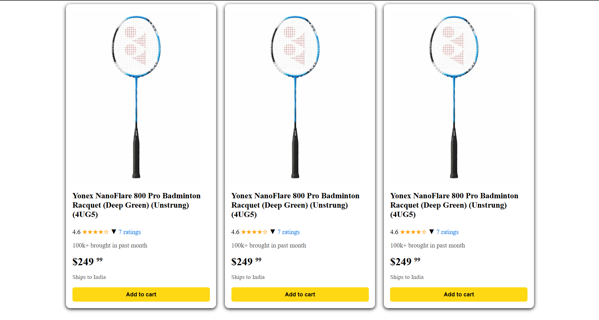

# Yonex NanoFlare 800 Pro Product Card UI

This is a simple, responsive product card UI built using HTML and CSS, showcasing the **Yonex NanoFlare 800 Pro Badminton Racquet (Deep Green) (Unstrung) (4UG5)**. The layout is clean and modern, inspired by e-commerce platforms like Amazon.

## 🔧 Features

- Product image and title
- Star rating system with review count
- Sales insights
- Price display with cents in superscript
- Delivery info section
- "Add to Cart" button linking to external purchase site
- Fully responsive using Flexbox

## 🛠️ Technologies Used

- HTML5
- CSS3

## 📷 Output Preview

